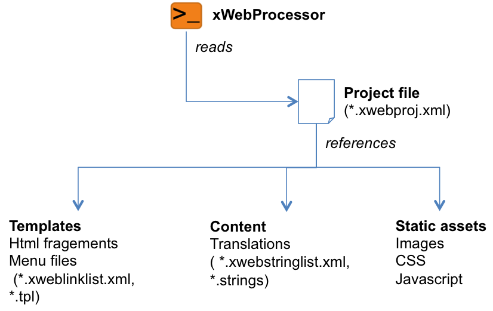

# xWebProcessor
## Introduction
In contrast to (old school) CMS systems,  modern web application do not rely anymore on the paradigm to generate the 
final complete html page entirely on the server side (like php, asp, jsp , etc.). Furthermore modern web application deliver only realtime data as ditionaries (json files) from a REST webservice and 
realize the rendering of the html pages on the client side (browser, using javascript). This approach is technically very mature due to tremdeous progress of the modern javascript engins (Google V8).
So only realtime data (frequently changed data) is traveling frequently through the network. All other data like translations, menu and page structure and so on, is generated offline and rendered 
on the client side (send only once when loading the html, javascript, css and assests). The modification of this kind of information is managed by the publication and release cycle of the web application. 
To work efficently with this approach, the use a static web 
site generator is recommand in order to handle web page structure and translations, tasks which had been done by the CMS sytem before.

The xWebProcessor is the implementation of such static web site generator based on XML. The author is clearly aware that there are a lot of other static website generators on the market these days.
Why implement another one? Actually it was not really mandatory. Other static web page generators are very powerful and in some areas maybe more efficent than the xWebProcessor. I implemented this tools
for two reasons: First: it was not a lot of effort (approxiamtly 2 days of work), second: It gaved me the possibility to adapte the markup language for the generation exactly to my needs.

## How does it work
The xWebProcessor is a command line tool which has one parameter is input: the project file. The following illustration outlines the basic topologie of the files used during the static web site generation.

current Version 0.1.0

Static web page generation base on XML.

## Compilation
### Requirements

- **boost 1.54.0** (http://www.boost.org): 
xWebProcessor uses boost for basic string anf file handling and for parsing the command line parameters.
- **xsd 3.3.0** (http://www.codesynthesis.com/products/xsd): 
xWebProcessor uses the excellent xsd tool in order to generated the xml schema - c++ bindings for xWebML (xWebMarkuplangauge).
- **ctemplate 2.2** (http://code.google.com/p/ctemplate): 
xWebProcessor uses the very efficient ctemplate library form Google for the basic templating, for example menu item generation.
